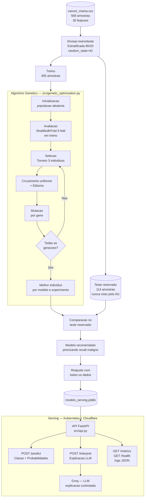
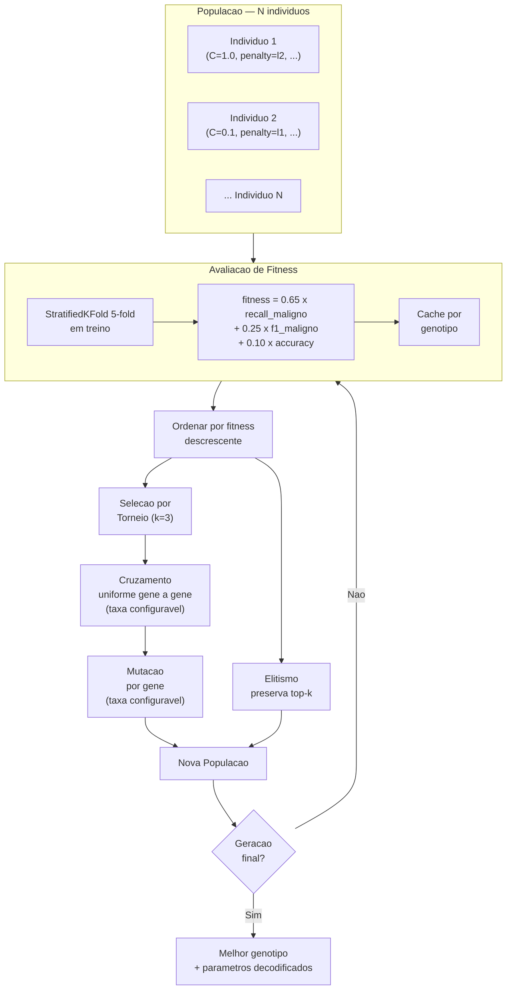
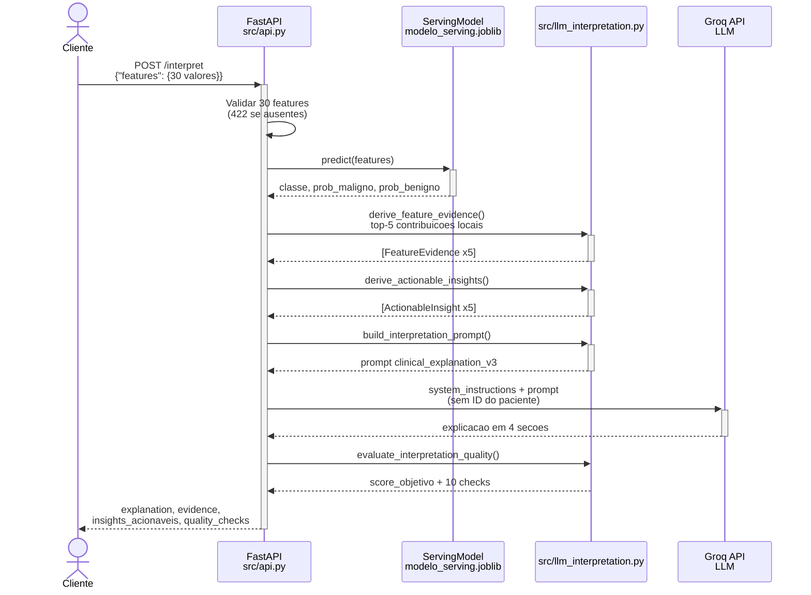
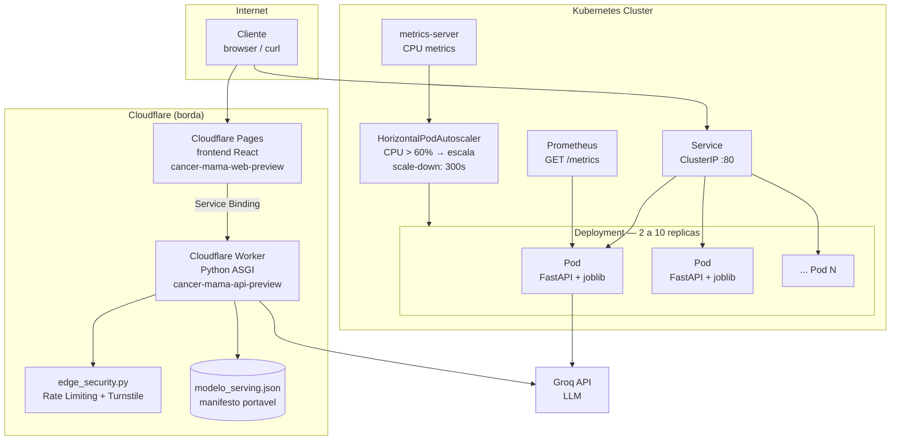

# Arquitetura e decisoes de implementacao - Tech Challenge 2

## 1. Objetivo

Esta extensao do Projeto 1 otimiza os modelos de diagnostico de cancer de
mama desenvolvidos na Fase 1 e prepara uma camada de inferencia escalavel.
O caso continua sendo classificacao binaria:

- `0`: tumor maligno;
- `1`: tumor benigno.

O principal risco do dominio e classificar um caso maligno como benigno.
Portanto, a decisao de otimizacao prioriza `recall` da classe Maligno.

## 2. Componentes

| Componente | Responsabilidade |
| --- | --- |
| `notebooks/02_otimizacao_genetica_cancer_mama.ipynb` | Relatorio executavel, experimentos e visualizacoes |
| `src/genetic_optimization.py` | Preparacao dos dados, algoritmo genetico, avaliacao e persistencia |
| `src/api.py` | API FastAPI para inferencia, interpretacao, health checks, metricas e logging |
| `src/llm_interpretation.py` | Prompt controlado e chamada a LLM via Groq |
| `src/evaluate_llm.py` | Avaliacao objetiva de interpretacoes em tres casos |
| `resultados/fase2/` | CSVs, logs, graficos e modelo serializado gerados em execucao |
| `Dockerfile` | Imagem da camada de inferencia |
| `deploy/k8s/` | Deployment, Service e HorizontalPodAutoscaler |

Fluxo:



## 3. Algoritmo genetico

### 3.1 Representacao dos genes

Cada individuo e uma tupla de indices inteiros. Cada posicao referencia um
alelo valido em um espaco discreto:

| Modelo | Genes |
| --- | --- |
| Regressao Logistica | `C`, `penalty`, `class_weight` |
| KNN | `n_neighbors`, `weights`, `p` |
| Arvore de Decisao | `max_depth`, `min_samples_split`, `min_samples_leaf`, `criterion`, `class_weight` |

A representacao discreta impede configuracoes invalidas. Na Regressao
Logistica otimizada, o solver `liblinear` foi fixado porque suporta os alelos
`l1` e `l2`. O baseline mantem o solver `lbfgs` usado no notebook original.

### 3.2 Operadores

| Operador | Decisao |
| --- | --- |
| Inicializacao | Alelos sorteados uniformemente dentro do dominio valido |
| Selecao | Torneio de tres individuos |
| Cruzamento | Uniforme, gene a gene |
| Mutacao | Substituicao aleatoria independente por gene |
| Elitismo | Melhor individuo preservado a cada geracao |



### 3.3 Fitness e avaliacao

```text
fitness = 0.65 * recall_maligno + 0.25 * f1_maligno + 0.10 * accuracy
```

O `recall_maligno` tem peso predominante por refletir a reducao de falsos
negativos. O `F1` evita que a sensibilidade seja elevada sem controle de
precisao, e a acuracia atua como criterio global secundario.

A fitness e calculada com `StratifiedKFold(n_splits=5, shuffle=True,
random_state=42)` apenas no treino. O teste reservado nunca orienta a
selecao genetica; ele e utilizado depois para a comparacao com a Fase 1.

### 3.4 Experimentos exigidos

| Experimento | Populacao | Geracoes | Cruzamento | Mutacao |
| --- | ---: | ---: | ---: | ---: |
| `E1_pop_pequena_mutacao_baixa` | 8 | 6 | 0.80 | 0.08 |
| `E2_balanceado` | 12 | 8 | 0.85 | 0.15 |
| `E3_exploratorio` | 16 | 10 | 0.90 | 0.30 |

Cada configuracao e executada para os tres modelos, totalizando nove buscas.

## 4. Observabilidade

### 4.1 Treinamento e experimentos

Ao executar o notebook ou `python -m src.genetic_optimization`, sao gerados:

| Artefato | Conteudo |
| --- | --- |
| `treinamento_ga.log` | fitness, recall e numero de candidatos por geracao |
| `experimentos_ga.csv` | melhor individuo de cada uma das nove buscas |
| `historico_geracoes.csv` | evolucao de fitness por geracao |
| `comparacao_baseline_otimizados.csv` | teste reservado: original versus otimizado |
| `resumo_execucao.json` | configuracoes, modelo escolhido e metricas |
| `modelo_serving.joblib` | pipeline recomendado para a API |

O melhor modelo otimizado permanece registrado no resumo e nas tabelas. Como
a comparacao final mostrou desempenho superior do baseline logistico, a API
serve esse baseline em vez de publicar uma variante otimizada inferior. Essa
escolha usa o teste reservado como decisao demonstrativa de deployment; nao
constitui uma nova estimativa imparcial de desempenho em producao.

### 4.2 Inferencia

A API oferece:

| Endpoint | Uso |
| --- | --- |
| `POST /predict` | Predicao e probabilidades para as 30 features |
| `GET /health/live` | Liveness do processo |
| `GET /health/ready` e `GET /health` | Readiness, falha se o modelo nao carregou |
| `GET /metrics` | Exposicao Prometheus |
| `POST /interpret` | Predicao acompanhada de explicacao em linguagem natural via LLM (Groq) |

Documentacao interativa (Swagger UI) com a API em execucao:
`http://127.0.0.1:8000/docs`. A rota raiz `/` nao existe e retorna
`{"detail":"Not Found"}` por padrao do FastAPI; use `/docs`, `/health` ou
os endpoints da tabela acima.

`/predict` e `/interpret` recebem o mesmo corpo `{"features": {...}}` com
as 30 features numericas do dataset Wisconsin, usando os nomes originais
das colunas (`radius_mean` ... `fractal_dimension_worst`). `/interpret`
exige `GROQ_API_KEY` configurada no ambiente da API; sem ela, retorna
`503`. Exemplo de chamada na secao 7.

Metricas Prometheus:

| Metrica | Finalidade |
| --- | --- |
| `diagnostico_requests_total` | Volume e erros por status |
| `diagnostico_predictions_total` | Distribuicao das classes previstas |
| `diagnostico_prediction_duration_seconds` | Latencia de inferencia |
| `diagnostico_model_ready` | Disponibilidade do artefato no pod |
| `diagnostico_llm_interpretations_total` | Sucessos e falhas de interpretacao |
| `diagnostico_llm_interpretation_duration_seconds` | Latencia da chamada a GPT |
| `diagnostico_llm_quality_score` | Resultado da rubrica automatica |

As requisicoes de predicao tambem produzem logs estruturados JSON com classe,
probabilidade maligna e identificacao do modelo, sem registrar dados do
paciente.

## 5. Interpretacao com LLM

A integracao utiliza a API do Groq com o modelo configuravel
`GROQ_LLM_MODEL` (`openai/gpt-oss-120b` por padrao). O endpoint `/interpret`
envia apenas classificacao, probabilidades e cinco contribuicoes locais, sem
`id` nem o vetor completo de features.

O prompt versionado `clinical_explanation_v3` exige linguagem apropriada ao
contexto medico, quatro secoes padronizadas, declaracao de limitacoes e
ausencia de prescricao. A v3 acrescenta regras de saude da mulher (situar
achados em cuidados tipicos do contexto sem presumir dados nao fornecidos),
sensibilidade de genero (veta linguagem alarmista/estigmatizante) e
privacidade/confidencialidade (veta qualquer identificador pessoal da
paciente). A qualidade pode ser avaliada com:

```bash
python -m src.evaluate_llm
```

O comando requer `GROQ_API_KEY` e produz os arquivos
`avaliacao_interpretacoes_llm.csv` e `interpretacoes_llm.json`. Sem chave, a
integracao permanece testavel com cliente simulado, mas nao produz avaliacao
de respostas reais.



Documentacao oficial utilizada:

- https://console.groq.com/docs/openai
- https://console.groq.com/docs/models

## 6. Escalabilidade automatica

O `Deployment` executa inicialmente duas replicas da API, com `requests` e
`limits` de CPU/memoria definidos. Esses `requests` sao necessarios para que
o HPA avalie utilizacao de CPU de forma coerente.

O modelo LLM e configurado por `GROQ_LLM_MODEL`. A variavel
`GROQ_API_KEY` e obtida opcionalmente do Secret
`cancer-mama-llm-secrets`: sem esse Secret, predicoes continuam disponiveis,
mas `POST /interpret` retorna indisponibilidade da LLM.

O `HorizontalPodAutoscaler` utiliza `autoscaling/v2`:

- minimo de 2 replicas e maximo de 10;
- aumento ao superar media de 60% de CPU solicitada;
- reducao estabilizada por 300 segundos para evitar oscilacao;
- health checks impedem roteamento para pods sem modelo carregado.

Em Kubernetes, o HPA por CPU depende do `metrics-server` instalado no cluster.
Prometheus e opcional para o HPA configurado, mas necessario para dashboards e
alertas baseados em latencia, erros ou distribuicao de predicoes.



## 7. Execucao

Na raiz do repositorio:

```bash
python -m pip install -r requirements.txt
python data/download_datasets.py
python -m src.genetic_optimization --data data/cancer_mama.csv --output resultados/fase2
python src/api.py
# ou:
uvicorn src.api:app --host 0.0.0.0 --port 8000
# apos configurar GROQ_API_KEY:
python -m src.evaluate_llm
```

Ou abra e execute `notebooks/02_otimizacao_genetica_cancer_mama.ipynb`.

O artefato `resultados/fase2/modelo_serving.joblib` e incluido na entrega para
permitir executar a API diretamente. Para reproduzi-lo, execute novamente o
notebook ou o comando de otimizacao. Para construir e aplicar a camada de
serving:

```bash
docker build -t tech-challenge-fase2-api:latest .
kubectl create secret generic cancer-mama-llm-secrets --from-literal=groq-api-key="$GROQ_API_KEY"
kubectl apply -k deploy/k8s
kubectl get deployment,service,hpa
```

Exemplo local de inferencia a partir da primeira linha do dataset:

```bash
python -c "import json,pandas as pd; d=pd.read_csv('data/cancer_mama.csv').drop(columns=['id','diagnosis']); print(json.dumps({'features': d.iloc[0].to_dict()}))" > requisicao.json
curl -X POST http://localhost:8000/predict -H "Content-Type: application/json" --data @requisicao.json
curl -X POST http://localhost:8000/interpret -H "Content-Type: application/json" --data @requisicao.json
curl http://localhost:8000/health
curl http://localhost:8000/metrics
```

`requisicao.json` segue o formato `{"features": {"radius_mean": 17.99, ...}}`
com as 30 colunas numericas do dataset (sem `id` nem `diagnosis`). O mesmo
arquivo serve para `/predict` e `/interpret`; a diferenca e que `/interpret`
exige `GROQ_API_KEY` configurada no ambiente da API. Veja exemplos completos
de corpo e resposta de cada endpoint no `README.md`, secao "Como chamar cada
endpoint".

## 8. Limitacoes e decisoes de producao

- O artefato da API e pequeno e esta incluido para tornar a demonstracao
  reprodutivel; ele tambem pode ser regerado pelo pipeline de treinamento.
- O dataset possui apenas 569 casos e nao constitui validacao externa.
- Nao ha autenticacao ou criptografia configuradas na API demonstrativa; em
  ambiente clinico esses controles seriam obrigatorios.
- As explicacoes da LLM exigem revisao especializada e nao sao diagnosticos.
- Predicoes devem apoiar revisao medica, nunca substituir diagnostico clinico.
