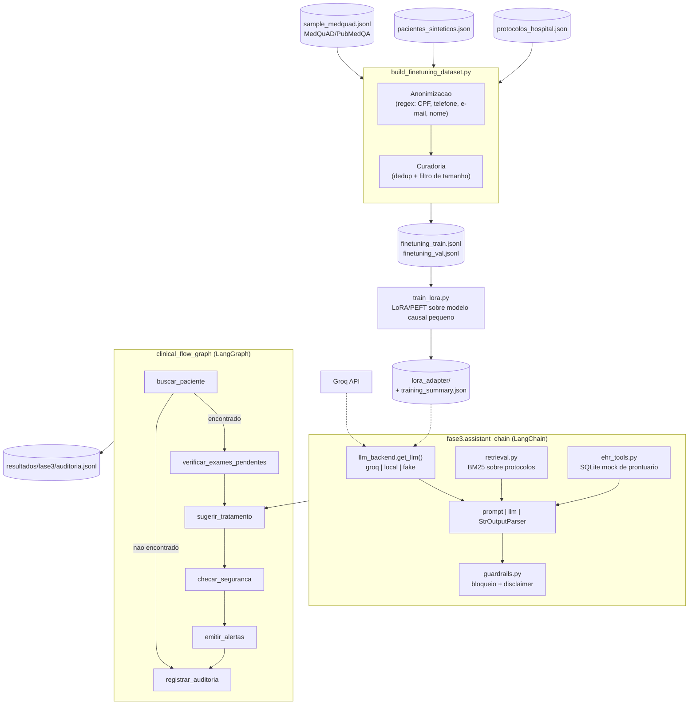
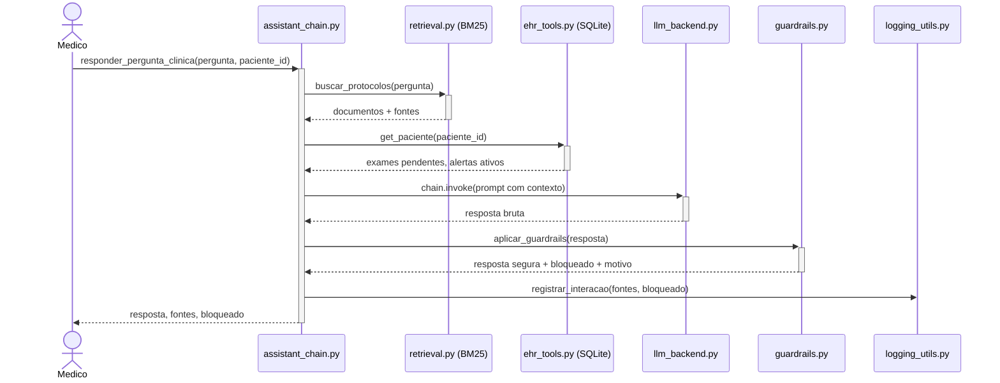
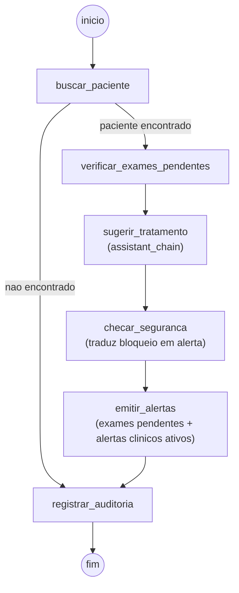

# Arquitetura e decisoes de implementacao - Tech Challenge 3

## 1. Objetivo

A Fase 3 avanca do modelo de diagnostico das Fases 1/2 para um **assistente
virtual medico** treinado com dados proprios (ficticios) do hospital,
capaz de responder duvidas clinicas de medicos e sugerir consultas a
protocolos internos, com fluxos de decisao automatizados e seguros
coordenados por LangChain/LangGraph.

Este modulo (`fase3/`) e isolado do restante do repositorio: nao altera
nada das Fases 1/2, mantendo o pipeline de diagnostico de cancer de mama
intacto.

## 2. Componentes

| Componente | Responsabilidade |
| --- | --- |
| `fase3/data/build_finetuning_dataset.py` | Preprocessing, anonimizacao (regex) e curadoria do dataset de fine-tuning |
| `fase3/data/protocolos_hospital.json` | Protocolos internos, FAQs e modelos de documento ficticios (PT) |
| `fase3/data/pacientes_sinteticos.json` | Prontuarios ficticios usados para semear o mock de EHR e gerar exemplos de treino |
| `fase3/data/sample_medquad.jsonl` | Amostra real do MedQuAD/PubMedQA (com atribuicao de fonte por linha) |
| `fase3/finetuning/train_lora.py` | Fine-tuning LoRA/PEFT de um LLM causal sobre o dataset combinado |
| `fase3/llm_backend.py` | LLM plugavel compativel com LangChain: `groq`, `local` (adapter LoRA) e `fake` (testes) |
| `fase3/retrieval.py` | Retrieval BM25 sobre os protocolos internos |
| `fase3/ehr_tools.py` | Mock de EHR estruturado (SQLite) semeado a partir dos prontuarios ficticios |
| `fase3/guardrails.py` | Bloqueio de prescricao direta, checagem de PII e disclaimer obrigatorio |
| `fase3/logging_utils.py` | Log de auditoria estruturado (stdout JSON + `resultados/fase3/auditoria.jsonl`) |
| `fase3/assistant_chain.py` | Pipeline LangChain (retrieval + LLM + guardrails + explainability) |
| `fase3/clinical_flow_graph.py` | Fluxo de decisao LangGraph (exames pendentes, sugestao, alertas) |
| `fase3/evaluate_assistant.py` | Avaliacao deterministica sobre casos representativos |
| `fase3/cli_demo.py` | Demo de ponta a ponta usada na gravacao do video |
| `notebooks/04_assistente_medico_fase3.ipynb` | Relatorio executavel do pipeline completo |

Fluxo geral:



## 3. Fine-tuning LoRA/PEFT

### 3.1 Dataset

`fase3/data/build_finetuning_dataset.py` combina tres fontes em um formato
unico `{instruction, input, output, source_type, source_id}`:

| Fonte | Exemplos | Observacao |
| --- | --- | --- |
| Protocolos internos (`PROT-001`..`PROT-012`) | Explicacao de protocolo + FAQs internas | Ficticios, escritos para este projeto |
| Prontuarios sinteticos | Perguntas sobre exames pendentes por paciente | Identificacao apenas por codigo (`PAC-000x`), nunca nome |
| MedQuAD (CancerGov, foco Breast Cancer) | 12 pares de pergunta/resposta | Dominio publico (orgao do governo dos EUA), via `abachaa/MedQuAD` |
| PubMedQA | 8 pares de pergunta/resposta (long answer) | Resumos de abstracts do PubMed, via `pubmedqa/pubmedqa` |

Cada texto passa por `anonimizar_texto()` (regex para CPF, telefone,
e-mail e rotulos de nome) antes de entrar no dataset — defensivo mesmo
sobre fontes ja sinteticas, simulando o que rodaria sobre dados reais do
hospital. A curadoria (`curar()`) remove duplicatas exatas e exemplos fora
da faixa de 20 a 1500 caracteres de resposta. O resultado (39 exemplos) e
dividido de forma deterministica em treino (33) e validacao (6).

### 3.2 Treinamento

`fase3/finetuning/train_lora.py` usa `transformers` + `peft` (LoRA) +
`datasets`, 100% CPU. As dependencias pesadas ficam em
`requirements-fase3.txt`, fora do `requirements.txt` principal, para nao
afetar a CI das Fases 1/2.

Um smoke test real foi executado com `distilgpt2` (82M parametros
pretreinados — nao um fixture aleatorio) para provar que o pipeline
efetivamente aprende:

| Epoca | Loss medio (treino) | Loss (validacao) |
| ---: | ---: | ---: |
| 1 | 4.7990 | 4.8405 |
| 2 | 4.5711 | 4.7904 |
| 3 | 4.4342 | 4.7692 |

Artefatos em `resultados/fase3/finetuning/smoke/` (`lora_adapter/` +
`training_summary.json`). Para um fine-tuning "de producao", basta trocar
o modelo base (ex.: `Qwen/Qwen2.5-0.5B-Instruct`) e os modulos de LoRA —
recomendado rodar em GPU (ex.: Google Colab), ja que o ambiente do projeto
e CPU-only.

## 4. Assistente clinico (LangChain) e explainability

`fase3.assistant_chain.responder_pergunta_clinica()`:

1. Recupera ate 3 protocolos relevantes via BM25 (`fase3/retrieval.py`,
   sem embeddings, 100% offline);
2. Busca o contexto estruturado do paciente no mock de EHR SQLite
   (`fase3/ehr_tools.py`), semeado a partir de `pacientes_sinteticos.json`;
3. Monta uma chain LCEL (`prompt | llm | StrOutputParser`) com o LLM
   plugavel (`fase3/llm_backend.py`);
4. Aplica os guardrails de seguranca (`fase3/guardrails.py`);
5. Registra o evento de auditoria com as fontes usadas (explainability).



Toda resposta segura recebe um disclaimer fixo informando que exige
validacao de um medico responsavel. Respostas com prescricao direta
(regex sobre verbos de acao + dose/via) ou com PII detectada nunca chegam
ao usuario — sao substituidas por uma mensagem padronizada e o motivo do
bloqueio fica registrado no log de auditoria.

## 5. Fluxo de decisao com LangGraph

`fase3.clinical_flow_graph` implementa o fluxo pedido no desafio: ao
receber informacoes de um paciente, o sistema verifica exames pendentes,
sugere conduta e emite alertas para a equipe medica.



A bifurcacao apos `buscar_paciente` e uma decisao real: se o codigo do
paciente nao existe no prontuario, o fluxo encerra com seguranca antes de
qualquer sugestao de conduta, em vez de arriscar uma resposta sem
contexto.

## 6. Seguranca, validacao e observabilidade

| Mecanismo | Implementacao |
| --- | --- |
| Nunca prescrever diretamente | `guardrails.contem_prescricao_direta()` bloqueia e retorna mensagem padrao |
| Validacao humana obrigatoria | Disclaimer fixo em toda resposta nao bloqueada |
| Ausencia de PII na resposta | `detectar_pii()` (CPF, telefone, e-mail, rotulo de nome) |
| Explainability | Toda resposta carrega a lista de protocolos usados (`id` + `titulo`) |
| Logging de auditoria | `logging_utils.registrar_interacao()` — stdout JSON + `resultados/fase3/auditoria.jsonl` |
| Avaliacao objetiva | `evaluate_assistant.py`, rubrica deterministica (sem LLM-juiz), mesma filosofia do `src/evaluate_llm.py` da Fase 2 |

## 7. Execucao

Na raiz do repositorio:

```bash
python -m pip install -r requirements.txt
python -m fase3.data.build_finetuning_dataset

# fine-tuning (opcional, dependencias pesadas):
python -m pip install -r requirements-fase3.txt
python -m fase3.finetuning.train_lora --output-dir resultados/fase3/finetuning/smoke

# demo usando a LLM customizada local (adapter LoRA treinado):
python -m fase3.cli_demo --paciente-id PAC-0001 \
  --pergunta "Posso iniciar a quimioterapia hoje?" \
  --backend local \
  --base-model distilgpt2 \
  --adapter-path resultados/fase3/finetuning/smoke/lora_adapter

# demo de ponta a ponta:
python -m fase3.cli_demo --paciente-id PAC-0001 --pergunta "Posso iniciar a quimioterapia hoje?"
# sem GROQ_API_KEY, use --backend fake

# avaliacao do assistente:
python -m fase3.evaluate_assistant --backend groq   # ou fake

# testes automatizados:
python -m unittest discover -s tests -v
```

Ou abra e execute `notebooks/04_assistente_medico_fase3.ipynb`.

## 8. Limitacoes e decisoes de producao

- Todos os protocolos, prontuarios e pacientes sao ficticios, criados para
  este projeto academico; nao refletem um hospital real.
- O smoke test de fine-tuning usa um modelo pequeno (`distilgpt2`) para
  manter o tempo de execucao razoavel sem GPU; um fine-tuning de producao
  exigiria um modelo maior e mais dados reais (anonimizados) do hospital.
- O retrieval usa BM25 (lexico) em vez de embeddings semanticos, escolha
  deliberada para manter o pipeline 100% offline e reproduzivel; um ganho
  de qualidade viria de um retriever semantico em producao.
- Os guardrails sao baseados em regras (regex), nao em um classificador
  treinado; cobrem os casos pedidos no desafio mas podem ter falsos
  negativos em frases fora do padrao esperado.
- Assim como na Fase 2, nenhuma sugestao do assistente substitui avaliacao
  clinica presencial ou decisao de um medico responsavel.
