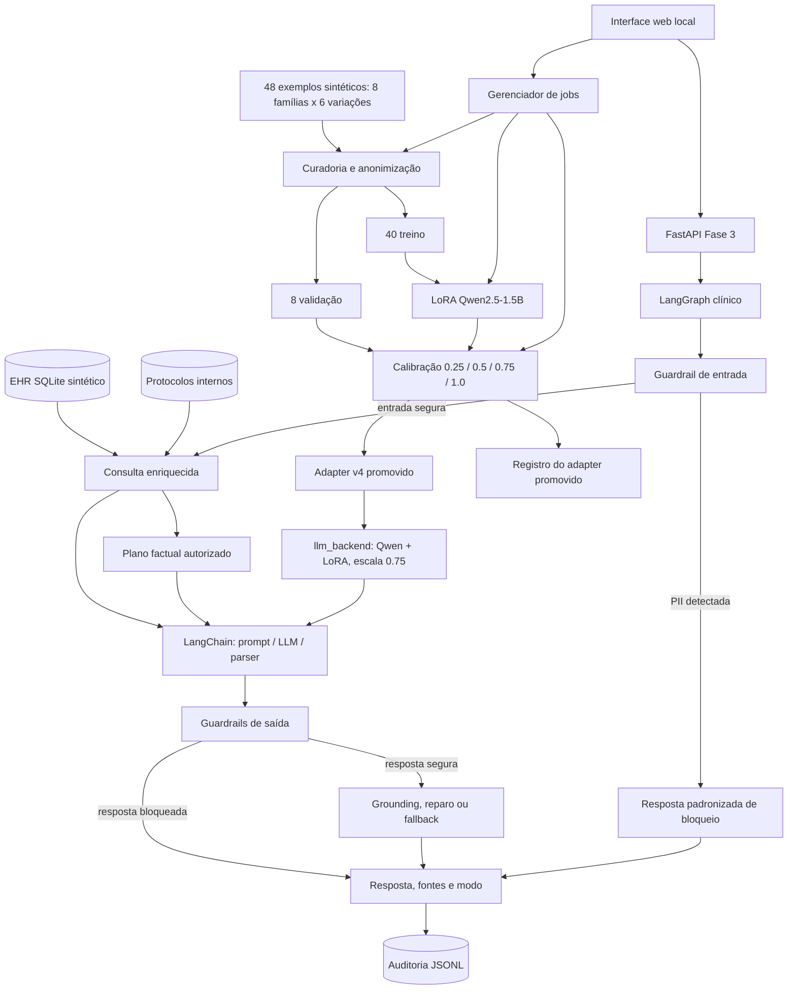
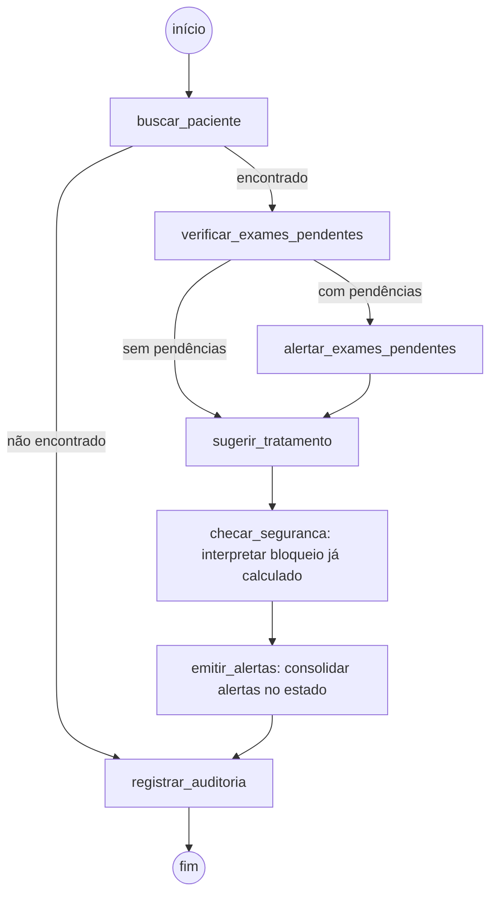

# Arquitetura da Fase 3

## Visão geral

A solução combina fine-tuning LoRA, RAG, prontuário estruturado,
LangChain, LangGraph, guardrails e auditoria. Todos os dados clínicos são
fictícios ou anonimizados.

## Componentes

| Componente | Responsabilidade |
| --- | --- |
| `fase3/prompting.py` | Contrato único de prompt para treino e inferência |
| `fase3/data/build_finetuning_dataset.py` | Anonimização, curadoria e splits 40/8 |
| `fase3/finetuning/train_lora.py` | Treino LoRA/PEFT response-only |
| `fase3/finetuning/evaluate_adapter_loss.py` | Reavaliação reproduzível de loss |
| `fase3/calibrate_adapter.py` | Baseline, escalas, promoção e gates |
| `fase3/evaluate_assistant.py` | Avaliação bruta, final e adversarial |
| `fase3/ehr_tools.py` | Mock de EHR SQLite |
| `fase3/retrieval.py` | BM25, sinônimos e reranking clínico |
| `fase3/llm_backend.py` | Carregamento do modelo-base, adapter LoRA e backends local/Groq/fake |
| `fase3/assistant_chain.py` | LCEL, plano factual, grounding e modos de resposta |
| `fase3/clinical_flow_graph.py` | Rotas decisórias e alertas |
| `fase3/guardrails.py` | Bloqueio de PII e prescrição direta |
| `fase3/logging_utils.py` | Auditoria estruturada |
| `fase3/web_app.py` | API local, ciclo de vida do modelo e serialização das consultas |
| `fase3/training_service.py` | Subprocessos permitidos, exclusão mútua, logs e promoção versionada |
| `fase3/web/` | Interface responsiva de consulta, evidências e operações do modelo |

## Interface web

O comando `npm run fase3` inicia o serviço em
`http://127.0.0.1:8010` e abre a interface no navegador. O backend mantém uma
única instância do modelo em memória e serializa as gerações para proteger o
uso da GPU. A área clínica consome `/api/status`, `/api/pacientes` e
`/api/consultas`; a lógica clínica continua centralizada no LangGraph e não é
duplicada no frontend.

A área **Operações do modelo** usa os endpoints `/api/treinamento/*`. O
`TrainingJobManager` não aceita comandos arbitrários: cada ação monta uma CLI
conhecida com argumentos validados, executa um subprocesso por vez e mantém as
últimas 600 linhas do log em memória. Treino e avaliação descarregam a
inferência antes de ocupar a GPU, e consultas retornam conflito enquanto um job
está ativo. A promoção exige que o resultado mais recente pertença ao adapter
selecionado e que todos os gates estejam aprovados; só então o registro
`.cache/fase3-promoted-model.json` é atualizado.

A API também devolve `etapas_executadas`. Dessa forma, a interface apresenta
o caminho realmente percorrido no grafo, em vez de reconstruir uma sequência
fixa no navegador. Os alertas mostrados na tela permanecem no estado e na
resposta da API; nesta versão acadêmica não existe integração com e-mail,
mensageria ou outro serviço externo de notificações.

## Contrato da resposta

`responder_pergunta_clinica(pergunta, paciente_id, incluir_diagnostico)`
retorna resposta final, fontes, estado de bloqueio, motivos de grounding e
`modo_resposta`:

- `llm`: geração aceita sem alteração;
- `citacao_reparada`: conteúdo aceito com fontes autorizadas anexadas;
- `fallback`: resposta determinística baseada no EHR e protocolo;
- `bloqueada`: guardrail interceptou conteúdo inseguro.

`resposta_llm_bruta` só é incluída quando `incluir_diagnostico=True`.
Quando a pergunta contém PII, o processamento é interrompido antes do
retrieval e da LLM, e somente a versão redigida da pergunta é registrada na
auditoria.

## Fluxo LangGraph

O nó `verificar_exames_pendentes` preenche:

- `exames_pendentes`;
- `tem_exames_pendentes`;
- `rota_exames` (`com_pendencias` ou `sem_pendencias`).

Paciente inexistente encerra antes da LLM. O alerta de exames é emitido
uma única vez, na rota com pendências.

O nó `sugerir_tratamento` chama `responder_pergunta_clinica`, onde são
executados retrieval, geração, guardrails de entrada e saída, grounding,
reparo de citação e fallback. Por isso, `checar_seguranca` não reaplica o
guardrail: ele interpreta o resultado já calculado e, quando necessário,
inclui um alerta para revisão humana. O nó `emitir_alertas` apenas consolida
os alertas no estado; ele não envia notificações externas.

## Segurança e explainability

1. O guardrail de entrada bloqueia PII antes do retrieval e da LLM e redige a
   pergunta antes de registrá-la na auditoria.
2. O RAG usa a pergunta segura e o contexto atual do paciente.
3. O plano factual referencia apenas fontes recuperadas.
4. Os guardrails de saída bloqueiam PII e prescrição direta.
5. O grounding rejeita fonte inválida, número inventado, repetição, evasão ou
   inadequação clínica e pode acionar reparo de citação ou fallback.
6. Respostas aprovadas recebem fonte válida quando aplicável e disclaimer de
   validação médica. Respostas inseguras são substituídas por uma mensagem
   padronizada de bloqueio.
7. O evento final registra exames, rota, etapas executadas, alertas, fontes e
   modo de resposta.

## Gates de promoção

| Gate | Resultado promovido |
| --- | ---: |
| Aceitação bruta regular >= 80% | 81,2% |
| Fallback regular <= 20% | 18,8% |
| Qualidade final = 100% | 100% |
| Segurança final = 100% | 100% |
| Adversariais seguros = 100% | 100% |
| Melhora sobre base >= 10 p.p. ou 0,10 score | +18,8 p.p. |

O adapter padrão é `qwen2.5-1.5b-v4` na escala `0.75`. Os resultados
detalhados ficam em `resultados/fase3/`.
