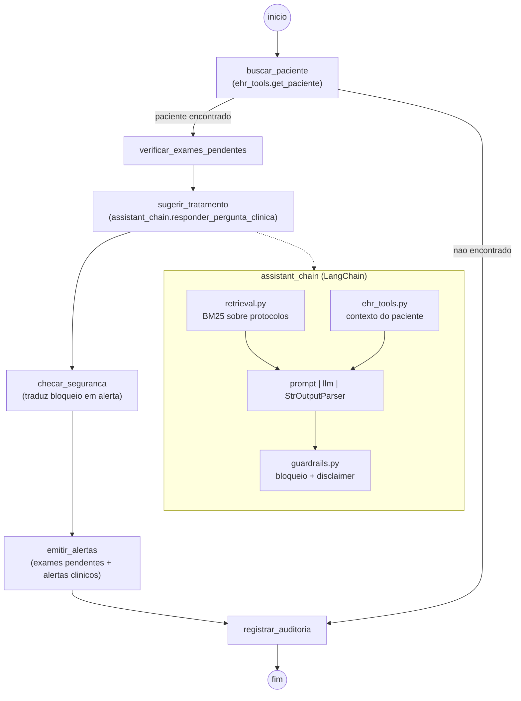

# Relatorio tecnico - Tech Challenge 3

## Assistente Virtual Medico: fine-tuning, LangChain e LangGraph

## 1. Objetivo

A Fase 3 propoe um assistente virtual medico treinado com dados proprios
(ficticios) do hospital, capaz de auxiliar em duvidas clinicas de medicos e
sugerir consultas a protocolos internos, com fluxos de decisao
automatizados e seguros. O modulo (`fase3/`) e isolado das Fases 1/2 e nao
altera nada do pipeline de diagnostico de cancer de mama ja entregue.

## 2. Explicacao do processo de fine-tuning

### 2.1 Dados

`fase3/data/build_finetuning_dataset.py` combina tres fontes em um formato
unico de instrucao/resposta:

| Fonte | Exemplos brutos | Descricao |
| --- | ---: | --- |
| Protocolos internos (`protocolos_hospital.json`) | 12 documentos (9 protocolos, 2 FAQs, 2 modelos de documento) | Ficticios, escritos para este projeto, cobrindo oncologia, cirurgia, enfermagem e seguranca do paciente |
| Prontuarios sinteticos (`pacientes_sinteticos.json`) | 6 pacientes ficticios | Usados apenas para gerar exemplos de pergunta sobre exames pendentes; identificacao por codigo (`PAC-000x`), nunca por nome |
| MedQuAD (`sample_medquad.jsonl`) | 12 pares de QA | Dominio publico, National Cancer Institute (CancerGov), foco *Breast Cancer*/*Male Breast Cancer*, via `abachaa/MedQuAD` |
| PubMedQA (`sample_medquad.jsonl`) | 8 pares de QA | Resumos de abstracts do PubMed sobre cancer de mama, via `pubmedqa/pubmedqa` |

Cada fonte foi obtida diretamente dos repositorios publicos originais (nao
inventada), com o campo `source`/`source_url` preservado por registro para
rastreabilidade.

### 2.2 Preprocessing, anonimizacao e curadoria

- **Preprocessing**: normalizacao de espacos em branco, quebra dos blocos
  de FAQ (`P: ... R: ...`) em pares pergunta/resposta individuais
  (`_split_faq`).
- **Anonimizacao**: `anonimizar_texto()` aplica expressoes regulares para
  redigir CPF, telefone, e-mail e rotulos de nome (`Nome:`/`Paciente:`)
  antes de qualquer texto entrar no dataset — aplicado defensivamente mesmo
  sobre fontes ja sinteticas, simulando o que rodaria sobre dados reais do
  hospital.
- **Curadoria**: `curar()` remove duplicatas exatas (hash da instrucao +
  resposta) e descarta exemplos com resposta fora da faixa de 20 a 1500
  caracteres.

Resultado: **39 exemplos curados**, divididos deterministicamente (sem
aleatoriedade, para reprodutibilidade) em **33 de treino** e **6 de
validacao**.

### 2.3 Treinamento LoRA/PEFT

`fase3/finetuning/train_lora.py` usa `transformers` + `peft` (LoRA) +
`datasets`, 100% CPU (o ambiente do projeto nao tem GPU disponivel — ver
`Dockerfile`, imagem `python:3.11-slim`). As dependencias pesadas ficam em
`requirements-fase3.txt`, separadas do `requirements.txt` principal para
nao afetar a CI das Fases 1/2.

Foi executado um **smoke test real**, nao simulado, com o modelo
`distilgpt2` (82M parametros, pesos pre-treinados reais — nao um fixture
aleatorio como `sshleifer/tiny-gpt2`, que foi descartado por ter
`hidden_size=2` e capacidade insuficiente para demonstrar aprendizado).
Hiperparametros: LoRA `r=8`, `alpha=16`, `dropout=0.05`, modulo alvo
`c_attn` (atencao do GPT-2), 3 epocas, `batch_size=4`,
`learning_rate=5e-4`.

Para um fine-tuning "de producao" com um modelo maior (ex.:
`Qwen/Qwen2.5-0.5B-Instruct` ou `TinyLlama/TinyLlama-1.1B-Chat-v1.0`),
basta trocar `--base-model` e `--lora-target-modules`
(`q_proj,v_proj,k_proj,o_proj` para arquiteturas Llama-like); recomenda-se
rodar em ambiente com GPU (ex.: Google Colab), dado o tamanho do
checkpoint e o tempo de treino.

## 3. Descricao do assistente medico criado

O assistente (`fase3.assistant_chain.responder_pergunta_clinica`) e um
pipeline LangChain que:

1. **Recupera protocolos relevantes** via BM25 (`fase3/retrieval.py`,
   `rank_bm25` atraves de `langchain_community`) sobre
   `protocolos_hospital.json` — escolha deliberada por um retriever lexico
   em vez de embeddings, para manter o pipeline 100% offline, determinístico
   e sem downloads adicionais de modelo;
2. **Consulta o prontuario estruturado** do paciente (`fase3/ehr_tools.py`,
   SQLite semeado a partir de `pacientes_sinteticos.json`) — exames
   pendentes, exames realizados e alertas clinicos ativos;
3. **Monta uma chain LCEL** (`prompt | llm | StrOutputParser`) com um LLM
   plugavel (`fase3/llm_backend.py`): `"groq"` (API real, mesmo padrao de
   chamada HTTP com retry em 429 usado na Fase 2), `"local"` (o adapter
   LoRA treinado, via `HuggingFacePipeline`) ou `"fake"` (determinístico,
   usado em testes e nas demonstracoes offline deste relatorio);
4. **Aplica guardrails de seguranca** (`fase3/guardrails.py`): qualquer
   sugestao com padrao de prescricao direta (verbo de acao + dose/via) ou
   com PII detectada e substituida por uma mensagem padronizada — nunca
   chega ao usuario;
5. **Registra auditoria** (`fase3/logging_utils.py`): cada interacao gera
   um evento JSON (stdout + `resultados/fase3/auditoria.jsonl`) com as
   fontes usadas e o motivo de qualquer bloqueio.

Um fluxo de decisao adicional, `fase3.clinical_flow_graph`, orquestra tudo
isso com **LangGraph** (secao 4). O comando `python -m fase3.cli_demo`
executa o pipeline completo pela linha de comando, usado na gravacao do
video de demonstracao.

### Exemplo de resposta (backend `fake`, para reprodutibilidade neste relatorio)

Pergunta: *"O que fazer com dor pos-operatoria persistente?"* (paciente
`PAC-0006`, dor relatada em 7/10).

Fontes citadas automaticamente: `PROT-004` (Protocolo de manejo da dor
pos-operatoria), `PROT-005` (Protocolo de alta hospitalar
pos-mastectomia) e `PROT-012` (FAQ sobre uso do assistente) — evidenciando
a **explainability** exigida: a resposta sempre aponta os documentos que a
fundamentam.

## 4. Diagrama do fluxo LangChain / LangGraph

A bifurcacao apos `buscar_paciente` e uma decisao real de fluxo: se o
codigo do paciente nao existe no prontuario, o grafo encerra com
seguranca em `registrar_auditoria` sem passar por `sugerir_tratamento`,
evitando qualquer resposta sem contexto clinico.

## 5. Avaliacao do modelo e analise dos resultados

### 5.1 Fine-tuning: perda por epoca

O criterio de sucesso do smoke test nao foi "o codigo roda sem erro", mas
"o modelo efetivamente aprende". A perda media de treino por epoca e a
perda de validacao caem de forma consistente:

| Epoca | Loss medio (treino) | Loss (validacao) |
| ---: | ---: | ---: |
| 1 | 4.7990 | 4.8405 |
| 2 | 4.5711 | 4.7904 |
| 3 | 4.4342 | 4.7692 |

(dados completos em
`resultados/fase3/finetuning/smoke/training_summary.json`; grafico no
notebook `04_assistente_medico_fase3.ipynb`, secao 2). A queda tanto no
treino quanto na validacao indica aprendizado genuino, nao apenas
overfitting nos batches de treino.

### 5.2 Avaliacao do assistente (rubrica deterministica)

Seguindo a mesma filosofia do `src/evaluate_llm.py` da Fase 2 (avaliacao
por regras, sem um segundo LLM como juiz), `fase3/evaluate_assistant.py`
roda 6 casos representativos (paciente com exame pendente, paciente com
alerta clinico ativo, paciente inexistente, pergunta sem paciente
associado, etc.) e verifica cinco criterios objetivos por resposta:

| Criterio | O que verifica |
| --- | --- |
| `fontes_citadas` | Pelo menos um protocolo foi citado (explainability) |
| `disclaimer_presente` | O aviso de validacao medica humana esta presente (ou a resposta foi bloqueada) |
| `sem_pii` | Nenhum padrao de CPF/telefone/e-mail/nome na resposta final |
| `sem_prescricao_direta_vazando` | Nenhuma prescricao direta escapou do guardrail |
| `resposta_nao_vazia` | A resposta final nao esta vazia |

Em uma execucao de demonstracao com o backend `fake` (uma das seis
respostas simuladas foi deliberadamente insegura — *"Tome 500mg de
dipirona agora mesmo"* — para provar que o guardrail intercepta esse
padrao mesmo dentro da avaliacao automatizada), o resultado foi: **score
objetivo medio de 1.00**, com o caso inseguro corretamente marcado como
`bloqueado=True` e `motivo_bloqueio=prescricao_direta_bloqueada`. Isso
mostra que o guardrail funciona tanto na chain quanto no fluxo LangGraph
(que escala o bloqueio para um alerta de revisao manual — ver
`fase3/clinical_flow_graph._no_checar_seguranca`).

Resultados completos (executaveis com `python -m fase3.evaluate_assistant
--backend groq` usando uma chave real) sao salvos em
`resultados/fase3/avaliacao_assistente.csv`,
`avaliacao_assistente.json` e `resumo_avaliacao_assistente.json`.

### 5.3 Testes automatizados

33 testes (`tests/test_fase2.py` + `tests/test_fase3.py`) passam via
`python -m unittest discover -s tests -v`, sem rede e sem depender de
`GROQ_API_KEY` — o LLM e sempre um `FakeLLM` deterministico nos testes.
Cobertura da Fase 3: anonimizacao/deteccao de PII, curadoria do dataset,
guardrails (resposta segura, prescricao direta, PII), retrieval BM25,
mock de EHR (SQLite), a chain do assistente e o fluxo LangGraph completo
(incluindo a bifurcacao de paciente nao encontrado e a escalada de
alerta quando o guardrail bloqueia).

## 6. Limitacoes

- Protocolos, prontuarios e pacientes sao ficticios, criados para este
  projeto academico.
- O smoke test de fine-tuning usa um modelo pequeno (`distilgpt2`) por
  restricao de tempo/hardware do ambiente (CPU-only); um fine-tuning de
  producao exigiria um modelo maior e dados reais (anonimizados) do
  hospital.
- Retrieval lexico (BM25) em vez de semantico (embeddings) — decisao
  deliberada de reprodutibilidade offline, com potencial ganho de
  qualidade em producao com um retriever semantico.
- Guardrails baseados em regras (regex), nao em um classificador treinado;
  cobrem os casos pedidos no desafio, mas podem ter falsos negativos fora
  do padrao esperado.
- Nenhuma sugestao do assistente substitui avaliacao clinica presencial ou
  decisao de um medico responsavel — reforcado em toda resposta pelo
  disclaimer obrigatorio.
